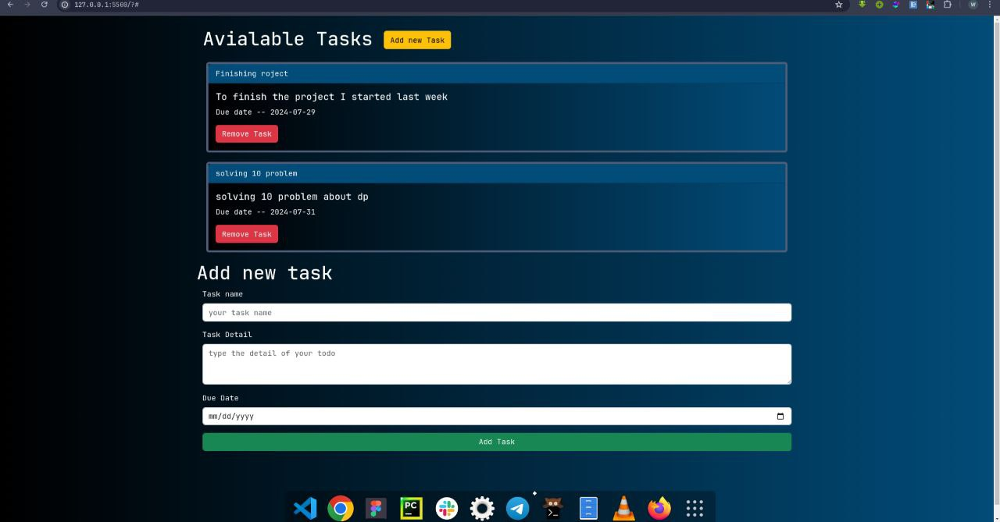
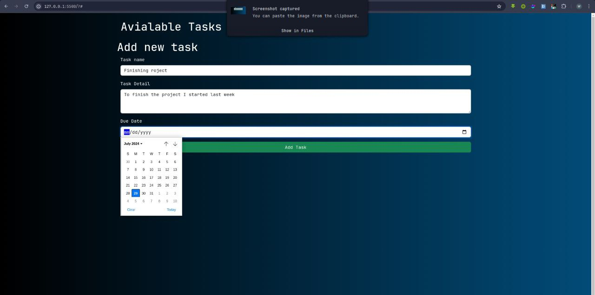

# Todo-app-with-JS

This is a simple Task Management Application that allows users to add, view, and delete tasks. The tasks are stored locally using the browser's local storage.

## Features

- **Add Task**: Users can add a new task with a name, due date, and detail.
- **View Tasks**: All the tasks are displayed as cards with the task name, details, and due date.
- **Delete Task**: Users can delete a specific task by clicking the "Remove Task" button.

## Technologies Used

- HTML
- Bootstrap
- JavaScript

## Screenshots

Include your three screenshots here. For example:







## Installation

1. Clone the repository:
   ```bash
   git clone https://github.com/your_username/Todo-app-with-JS.git
   ```
2. Navigate to the project directory:
   ```bash
   cd Todo-app-with-JS
   ```
3. Open the `index.html` file in your preferred browser.

## Usage

1. **Add a Task**:
   - Enter the task name, due date, and details in the provided fields.
   - Click the "Add Task" button to create a new task.
   
2. **View Tasks**:
   - All tasks will be displayed in the task list section as cards.
   
3. **Delete a Task**:
   - Click the "Remove Task" button on the task card to delete the task.


## Local Development

1. Make sure you have a modern web browser installed (Chrome, Firefox, Edge, etc.).
2. Open the `index.html` file in your browser to see the application in action.
