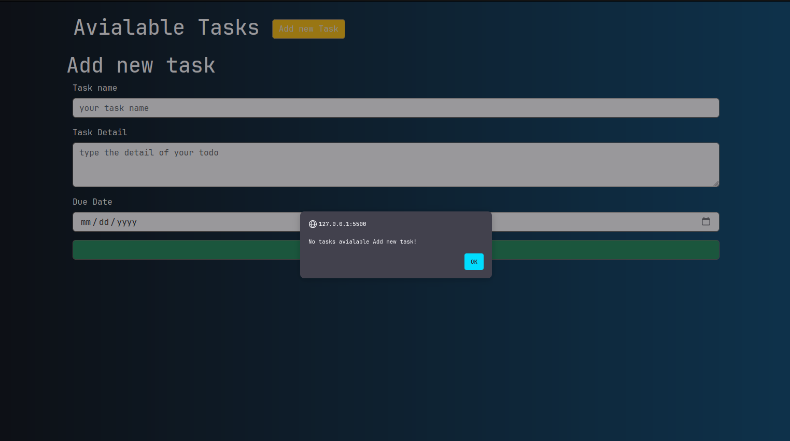
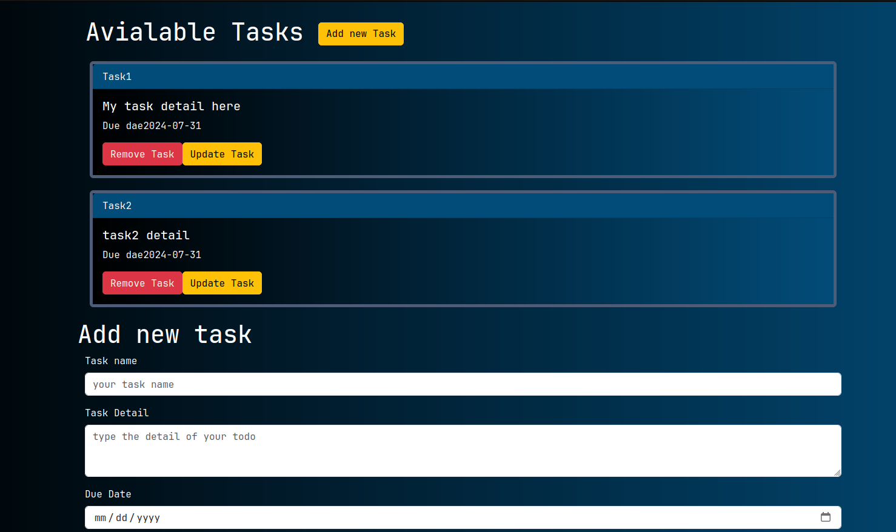
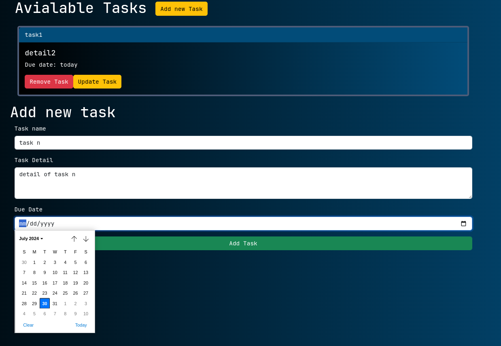
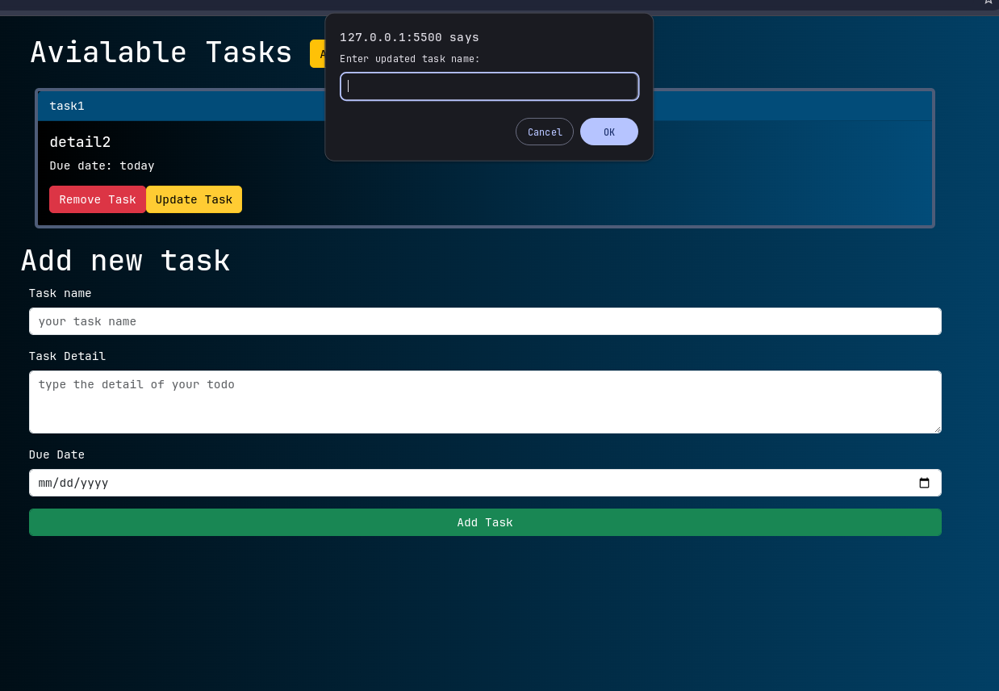

# Todo-app-with-Ts

This is a simple Task Management Application that allows users to add, view, and delete tasks. 
## Features

- **Add Task**: Users can add a new task with a namand detail.
- **View Tasks**: All the tasks are displayed  with the task name, detail.
- **Delete Task**: Users can delete a specific task by selecting with its name.

## Technologies Used

- Typescript
- JavaScript
## Screenshots


## option list


## Adding task to task list


## task list


## updating and deleting tasks


## Installation

1. Clone the repository:
   ```bash
   git clone https://github.com/your_username/Todo-app-with-JS/task2.git
   ```
2. Navigate to the project directory:
   ```bash
   cd Todo-app-with-JS/task2
   ```
3. Run the following command:
    ```bash
    node todo.js
    ```

## Usage

1. **Add a Task**:
   - select the "Add Task" ooption to create a new task.
   - Enter the task name and details in the provided fields.


2. **View Tasks**:
   - select list all task option to see the tasks.

3. **Delete a Task**:
   - select the "Remove Task" option to delete the task.


## Local Development

Make sure you have Node.js installed