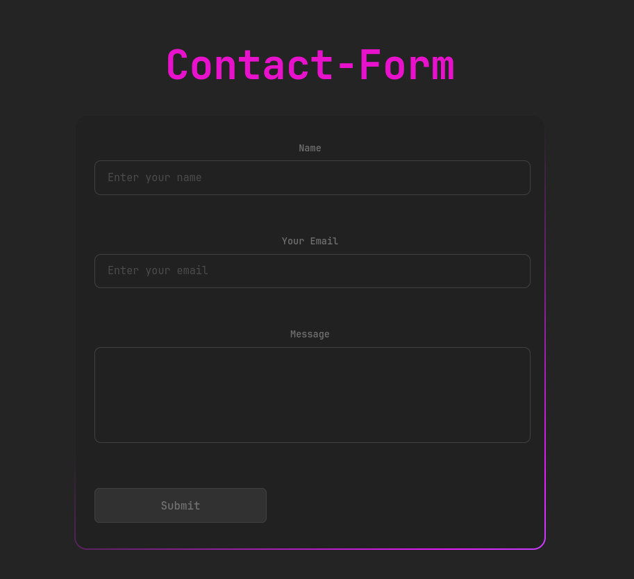
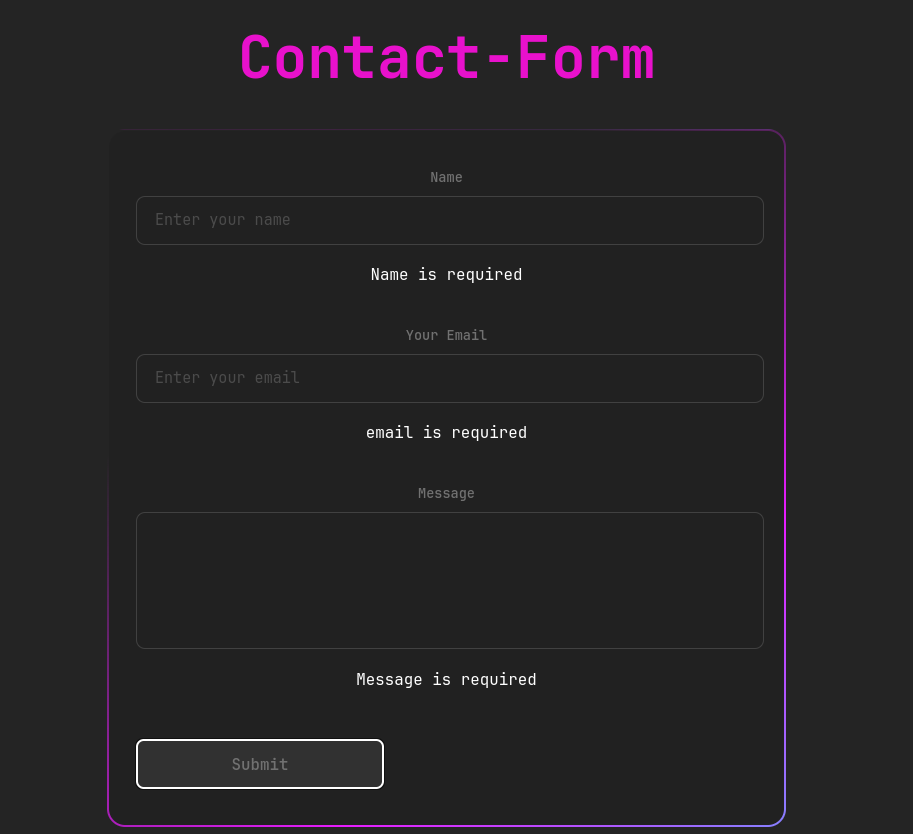
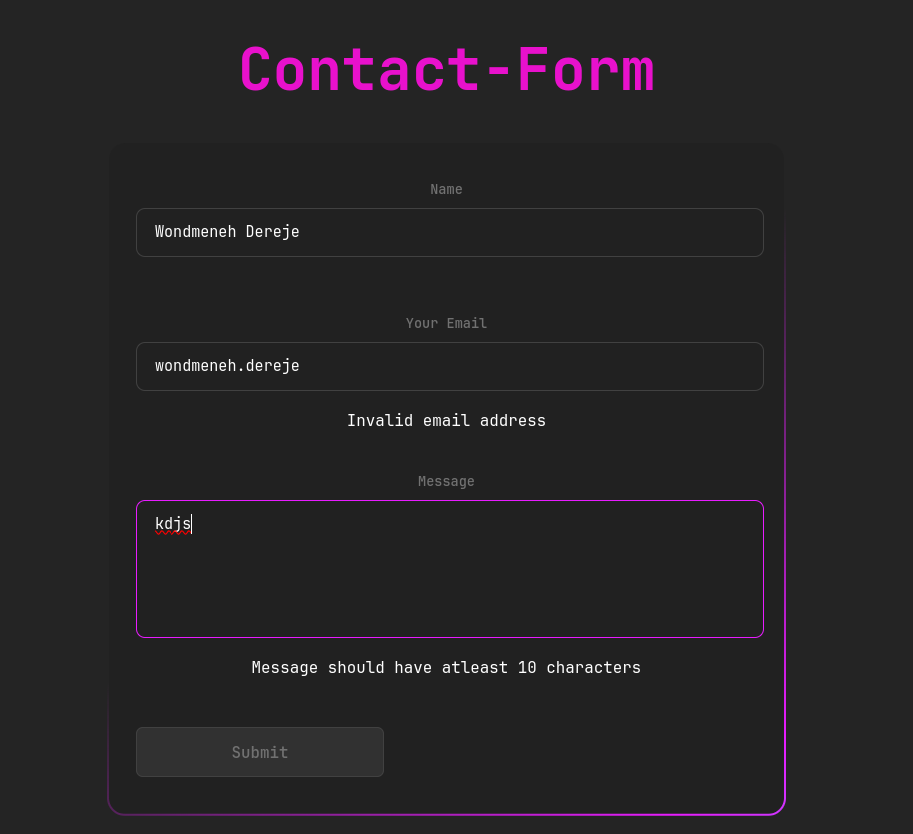
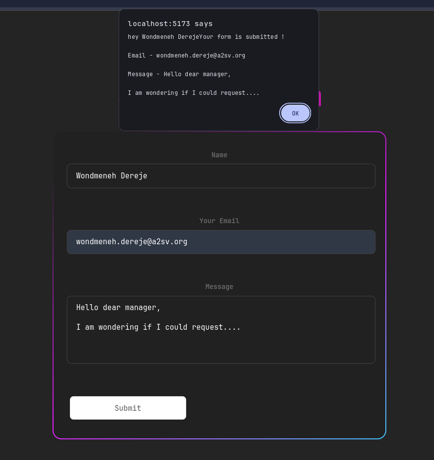

# Contact from with React
## besically to implement React-Hook-Form

This is a simple contact form  built with React and TypeScript. It allows users users to send contact message.

## Features

- validates required feildes of the form (In our case all feilds are required)
- validates the format of the email address(The emailaddress needs to be in correct format)
- checkes the message length is not greater than 500 charcter and not less than 10 characters)
- Implemented simply with the help of react-hook-form 
- Displays all error messges 


## Screenshots


Initial look of the form


The required validation


Email validation and textarea length cheking 


Confirming the submission of the Form


## Getting Started

To get a local copy up and running, follow these simple steps.

### Prerequisites

You need to have Node.js and npm installed on your machine. You can download them from [Node.js](https://nodejs.org/).

### Installation

1. Clone the repository

   ```sh
   git clone https://github.com/your_username/Todo-app-with-JS.git
   ```

2. Navigate to the project directory

   ```sh
   cd Todo-app-with-JS/task5
   ```

3. Install the dependencies

   ```sh
   npm install
   ```

### Running the Application

1. Start the development server

   ```sh
   npm run dev
   ```

2. Open [http://localhost:5173](http://localhost:5173) to view it in the browser.

### Usage

- **Fill the sorms and hit the submitt button**

## Project Structure

```plaintext
├── public
│   ├── index.html
│   └── ...
├── src
│   ├── components
│   │   ├── ContactForm.tsx
│   │   
│   ├── App.tsx
│   ├── App.css
│   └── ...
├── package.json
├── tsconfig.json
└── ...
```

## Technologies Used

- **React**: A JavaScript library for building user interfaces.
- **React-Form-Hooks**: A react hooks to simplify the form submission handling.
- **TypeScript**: A typed superset of JavaScript that compiles to plain JavaScript.
- **CSS**: For styling the application.


