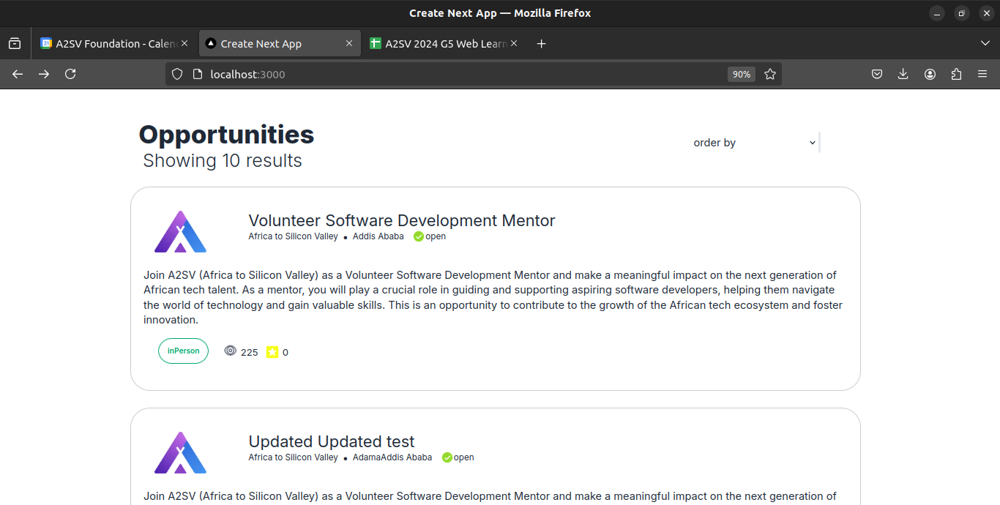
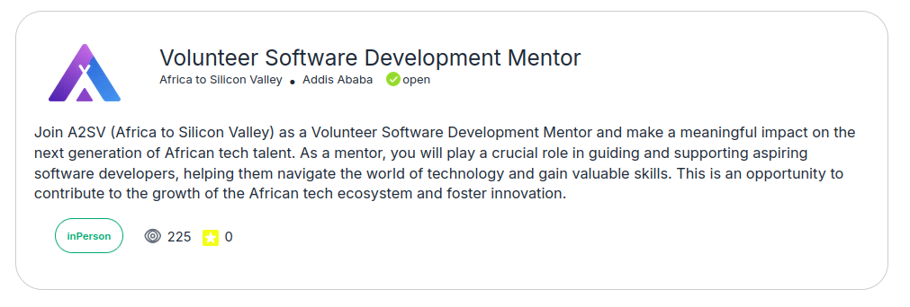

# Job Listing Application

## Overview

This project is a next_js-based job listing application that displays job listings in a card format. The application uses Tailwind CSS for styling and incorporates data from the akill connect api.

## Features

- **Job Card Component**: A visually appealing card that displays job details.
- **Api Data**: Fetched the data from the akill api.
- **Applicants Dashboard**: A dashboard view for job descriptions.
 

## Components

1. **JobCard**: The main component representing a job listing card more detaild than in the task6 .
2. **ApplicantsDashboard**: The dashboard that includes job descriptions and other relevant details.

## Steps to Complete the Task

### 1. Design the Card

Created a `JobCard` component that closely resembles the provided design, focusing on layout, colors, and typography.

### 2. Fetching Api data

Utilized the provided api data to populate the `JobCard` component with fields like name, title, and description views.

### 3. Add Avatar Image

Incorporated the provided avatar image URL into the `JobCard` component and ensured it was displayed properly.

### 4. Create the Applicants Dashboard

Used Tailwind CSS to style the job description and other elements within the `ApplicantsDashboard` component.

### 5. Code Quality

Maintained clean, well-organized code throughout the task.

## Screenshots

### Job Card Component



**Description**: This screenshot shows the job cards page .


**Description**: This screenshot job detail created based on the Figma file, styled using Tailwind CSS.

### Applicants Dashboard


**Description**: specific card detail


**Description**: 

## How to Run the Project

1. **Clone the Repository**

```bash
git clone https://github.com/wondmD/A2SV-project-phase.git
cd task7
```

2. **Install Dependencies**

```bash
npm install
```

3. **Start the Development Server**

```bash
npm start
```

4. **Open the Application**

Navigate to `http://localhost:3000` in your web browser to view the application.

## Code Structure

```
job-listing-app/
├── public/
│   ├── pic.png
│   └── images
├── app/
│   ├── detail/
│   │   ├── [jobId]
│   │   └── components
|   |   |   |_about.tsx ....
|   |   |   |_
|   |   |________________data.tsx
|   |   |________________drop.tsx
│   ├── data.tsx
│   │  
│   ├── App.js
│   ├── index.css
│   └── index.js
├── node_modules
├── tailwind.config.js
├── package.json
└── README.md
```

## Technologies Used

- Next js 
- Tailwind CSS

## Contact
