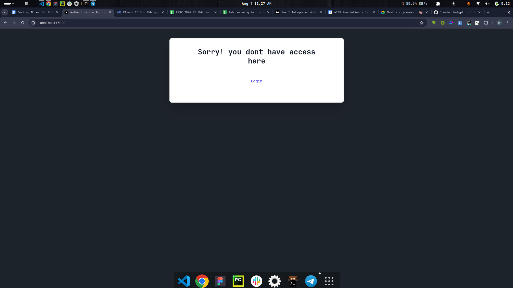
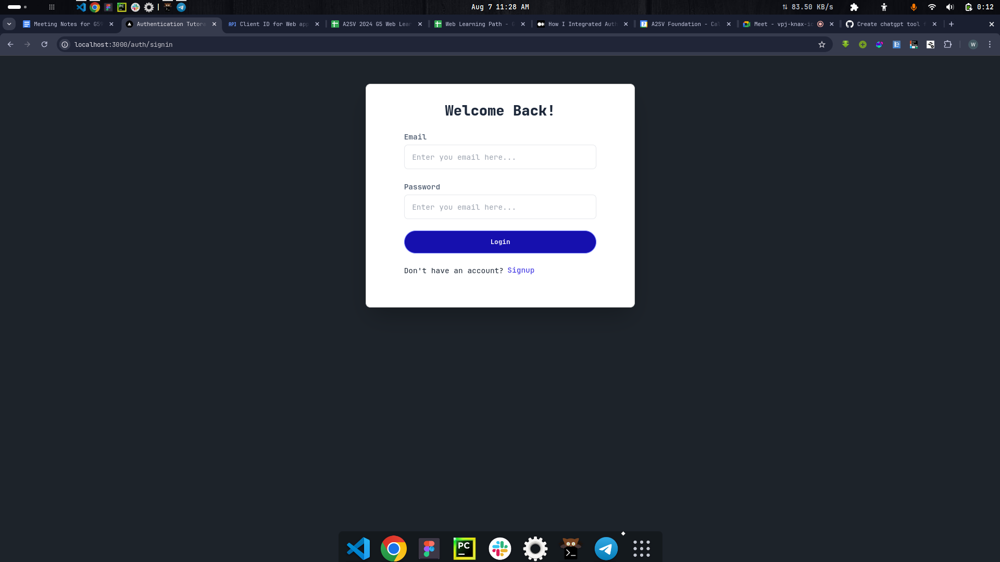
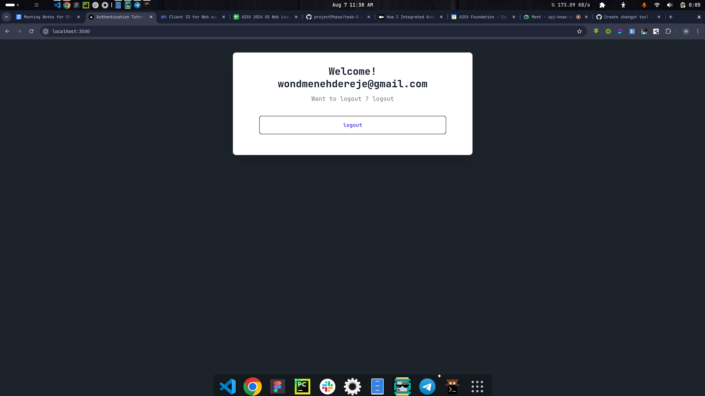
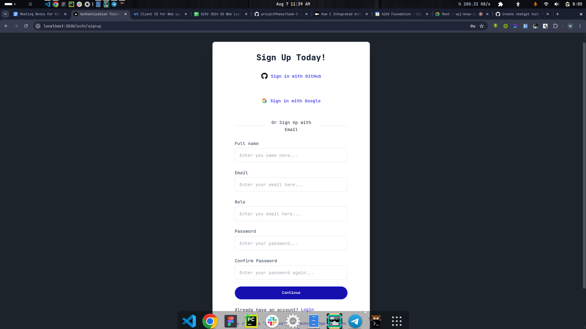
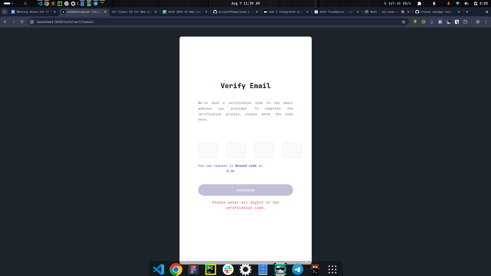
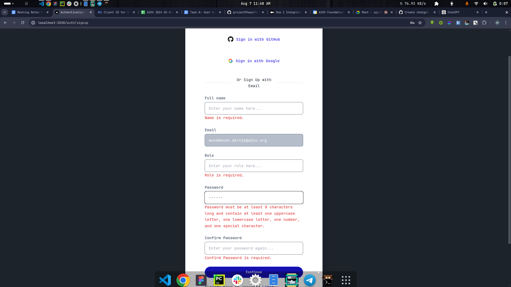

# Next.js Authentication Project

This project is a Next.js application that implements authentication using NextAuth. It supports multiple providers, including credentials, GitHub, and Google.

## Features

- User authentication with credentials (email and password)
- OAuth authentication with GitHub and Google
- Redirect to the home page after successful login
- Email verification for user registration

## Technologies Used

- Next.js
- NextAuth.js
- TypeScript
- Tailwind CSS

## Setup and Installation

### Prerequisites

- Node.js (version 14.x or later)
- npm or yarn
- Environment variables for GitHub and Google OAuth

##screenshoots


**Description**: The home page



**Description**: Login page


**Description**: Logedin user


**Description**: signup page


**Description**: Email verification


**Description**: Client side input validation

### Installation

1. Clone the repository:

   ```bash
   git clone https://github.com/your-username/your-repo.git
   cd your-repo
   ```

2. Install the dependencies:

   ```bash
   npm install
   # or
   yarn install
   ```

3. Create a `.env.local` file in the root directory and add the following environment variables:

   ```env
   NEXTAUTH_URL=http://localhost:3000
   GITHUB_ID=your-github-client-id
   GITHUB_SECRET=your-github-client-secret
   GOOGLE_ID=your-google-client-id
   GOOGLE_SECRET=your-google-client-secret
   ```

4. Run the development server:

   ```bash
   npm run dev
   # or
   yarn dev
   ```

   Open [http://localhost:3000](http://localhost:3000) with your browser to see the result.

## Project Structure

```bash
.
├── app
│   ├── auth
│   │   ├── signup
│   │   │   └── page.tsx
│   │   ├── signin
│   │   │   └── page.tsx
│   │   └── verifyemail
│   │       └── page.tsx
│   └── layout.tsx
│   └── page.tsx
├── components
│   ├── input.tsx
│   ├── resend.tsx
│   └── continuebutton.tsx
├── pages
│   └── api
│       └── auth
│           └── [...nextauth]
├── styles
│   └── globals.css
├── .env.local
├── next.config.js
├── package.json
└── README.md
```

## Usage

### Authentication

#### Credentials Provider

Users can log in with their email and password. The credentials are sent to the `/login` endpoint of the backend API for verification.

#### GitHub and Google Providers

Users can log in using their GitHub or Google accounts. Ensure you have set up the OAuth applications on GitHub and Google and have added the respective client IDs and secrets to your `.env.local` file.

### Email Verification

After signing up, users are required to verify their email address. An OTP is sent to their email, and they must enter it on the verification page.

## Customization

- **Styling**: The project uses Tailwind CSS for styling. You can customize the styles in the `styles/globals.css` file.
- **Providers**: Add or remove authentication providers in the `nextauthOptions` configuration in the `pages/api/auth/[...nextauth].ts` file.

